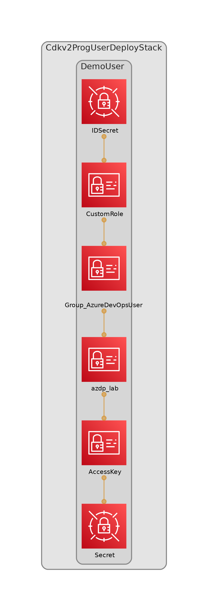

<!-- START doctoc generated TOC please keep comment here to allow auto update -->
<!-- DON'T EDIT THIS SECTION, INSTEAD RE-RUN doctoc TO UPDATE -->
**Table of Contents**  

- [DevSecOps with AWS- Integrate Azure DevOps for CDK deployments](#devsecops-with-aws--integrate-azure-devops-for-cdk-deployments)
- [Hands On](#hands-on)
  - [Requirements](#requirements)
  - [AWS Services and tools](#aws-services-and-tools)
  - [Solution Overview](#solution-overview)
    - [Conditions:](#conditions)
  - [The CDK project](#the-cdk-project)
    - [The project structure](#the-project-structure)
    - [Project parameters](#project-parameters)
- [Deploy CDK Python project!](#deploy-cdk-python-project)
  - [Useful commands](#useful-commands)

<!-- END doctoc generated TOC please keep comment here to allow auto update -->

# DevSecOps with AWS- Integrate Azure DevOps for CDK deployments 

Please Visit [DevSecOps with AWS- Integrate Azure DevOps for CDK deployments Part-1 ](https://dev.to/avelez/devsecops-with-aws-integrate-azure-devops-for-cdk-deployments-part-1-c4e) 

_**Level 300**_

There are many tools and services for CI/CD pipelines and possibilities to integrate them with AWS Cloud. The challenge is keeping the flexibility without lost the security and limit the operational overload. In this series you’ll find a common scenario that easily you can extrapolate as pattern to manage the identity for these kinds of integrations. 

Imagine that you are a DevSecOps engineer and need to integrate Azure DevOps securely to your AWS Cloud environment, you need to have a single point to manage the identity, apply the **least privilege** principle and don’t affect the current deployments and account setups that currently your developers’ teams had been doing with CDK.

# Hands On

## Requirements 

- cdk >= 2.60.0
- AWS CLI >= 2.7.0
- Python >= 3.10.4
- Pytest >= 7.1.3
- cdk-nag >=2.18.44
- checkov >= 2.1.229
- AWS Toolkit for Azure DevOps
- Azure DevOps Account

## AWS Services and tools

- [AWS Cloud Development Kit (CDK)](https://aws.amazon.com/cdk/): is an open-source software development framework to define your cloud application resources using familiar programming languages.
- [AWS Identity and Access Management (IAM)](https://aws.amazon.com/iam/?nc2=h_ql_prod_se_iam): Securely manage identities and access to AWS services and resources.
- [AWS IAM Identity Center (Successor to AWS Single Sign-On)](https://aws.amazon.com/iam/identity-center/): helps you securely create or connect your workforce identities and manage their access centrally across AWS accounts and applications.
- [AWS Key Management Service (AWS KMS)](https://aws.amazon.com/kms/): lets you create, manage, and control cryptographic keys across your applications and more than 100 AWS services.
- [AWS CloudFormation](https://aws.amazon.com/cloudformation/): Speed up cloud provisioning with infrastructure as code as code

- [AWS Security Token Service](https://docs.aws.amazon.com/STS/latest/APIReference/welcome.html): web service that enables you to request temporary, limited-privilege credentials for AWS Identity and Access Management (IAM) users or for users you authenticate (federated users).
- [AWS Secrets Manager](https://aws.amazon.com/secrets-manager): a secrets management service that helps you protect access to your applications, services, and IT resources. This service enables you to easily rotate, manage, and retrieve database credentials, API keys, and other secrets throughout their lifecycle.

- [AWS Toolkit for Azure DevOps](https://marketplace.visualstudio.com/items?itemName=AmazonWebServices.aws-vsts-tools):  adds tasks to easily enable build and release pipelines in Azure DevOps (formerly VSTS) and Azure DevOps Server (previously known as Team Foundation Server (TFS)) to work with AWS services including Amazon S3, AWS Elastic Beanstalk, AWS CodeDeploy, AWS Lambda, AWS CloudFormation, Amazon Simple Queue Service and Amazon Simple Notification Service, and run commands using the AWS Tools for Windows PowerShell module and the AWS CLI.

## Solution Overview

### Conditions: 

- Restrict time range for lifetime user credentials.
- Apply context conditions to improve and reduce risk. 
- Use IaC.
- Don’t affect current setup.

> Visit [DevSecOps with AWS - Multi Environment deployments - Part 1](https://dev.to/avelez/devsecops-with-aws-multi-environment-deployments-part-1-16i6) for bootstrapping accounts using CDK. :point_left:

The figure 1. Depicts the solution architecture. 

<center>


**Figure 1**. Solution Architecture

</center>

First, the service connection is created in Azure DevOps  through AWS Toolkit, using access key, secret access key, external id, ARN role for assuming for any AWS task and session name. 

Second, for a task that requires AWS access use the service connection credentials. 

> Keep in mind that these credentials are temporary, and the duration session is one hour. 

Third, the CDK command assume role for target account base on the environment properties in the CDK application.

Finally, the app is deployed in target account.

## The CDK project

### The project structure



### Project parameters
All project definitions are in `project_configs/environment_options/environment_options.yaml`
> Copy the `project_configs/environment_options/environment_options_template.yaml`


```yaml

project_name: "AzureDevOpsUser"
# Repository definitions
repository_properties:
  repository_name: "cdkv2_prog_user_deploy"
  create_repository: "true"
  description: "Repository for azure devops cdk user"
  branch: "master"

# Multi Environment setup
devsecops_account: "123456789012"
devsecops_region: "us-east-2"

deployment_account: "123456789012"
deployment_region: "us-east-2"

stg_account: "123456789014"
stg_region: "us-east-2"

iam_properties:
  user_name: "azdp_lab"
  context:
    from: "2023-01-01T00:00:00Z"
    up: "2023-06-30T23:59:59Z"
  assume_roles:
    - arn: "arn:aws:iam::123456789014:role/cdk-hnb659fds-deploy-role-123456789014-us-east-2"
    - arn: "arn:aws:iam::123456789014:role/cdk-hnb659fds-lookup-role-123456789014-us-east-2"


# Tags definitions align with corporation instructions
tags:
  - key: "Project"
    value: "AzureDevOpsUser"
  - key: "Environment"
    value: "dev"
  - key: "Owner"
    value: "DevSecOpsAdm"

```

The main block is `iam_properties`, here the properties for IAM **programmatic** user are defined. First, the username, followed by **context composed for start date and end date** this time range indicate the valid range to assume principal role. Second, assume_roles parameters composed by ARN roles.
 
> These conditions are good but could be better :ok_hand:

Those roles are creating for CDK when you run the cdk bootstrap command. Each role is created for a specific function and depends on the stack components one or more roles are used. The Figure 2 depicts the roles in an AWS Account.

<center>


**Figure 2.** CDK Roles

</center>

In the `src/constructs/iam_role.py` the IAMSetup construct is define: 

```python
from aws_cdk import (
    Aws,
    aws_iam as iam,
    aws_secretsmanager as secretsmanager,
    CfnOutput

)
from constructs import Construct


class IAMSetup(Construct):

    def __init__(self, scope: Construct, construct_id: str, props: dict, **kwargs) -> None:
        super().__init__(scope, construct_id, **kwargs)
        # Getting props
        project_name = props.get("project_name", "demo")
        roles = props.get("iam_properties", {}).get("assume_roles", [])
        user_name = props.get("iam_properties", {}).get("user_name", f"{project_name}_user")
        context = props.get("iam_properties", {}).get("context", {"from": "2023-01-01T00:00:00Z",
                                                                  "up": "2023-06-30T23:59:59Z"})

        rs = []
        if roles:
            for r in roles:
                rs.append(r["arn"])
        else:
            rs = [f"arn:aws:iam::{Aws.ACCOUNT_ID}:role/cdk-hnb659fds-cfn-exec-role-{Aws.ACCOUNT_ID}-{Aws.REGION}"]
        # Creating statement
        st = iam.PolicyStatement(actions=["sts:AssumeRole"], effect=iam.Effect.ALLOW, resources=rs)

        ext_id = secretsmanager.Secret(self, "IDSecret", secret_name=f"/{project_name}/SecretExternalID",
                                       generate_secret_string=secretsmanager.SecretStringGenerator(
                                           secret_string_template='{"type": "role_ext_id"}',
                                           exclude_punctuation=True,
                                           exclude_characters="-`",

                                           generate_string_key='external_id'
                                       )
                                       )
        self.role = iam.Role(self, "CustomRole", role_name=f"Role{project_name.capitalize()}",
                             assumed_by=iam.PrincipalWithConditions(iam.AccountPrincipal(account_id=Aws.ACCOUNT_ID),

                                                                    conditions={
                                                                        "StringLike": {
                                                                            "sts:RoleSessionName": "${aws:username}"
                                                                        },
                                                                        "DateGreaterThan": {
                                                                            "aws:CurrentTime": context["from"]},
                                                                        "DateLessThan": {
                                                                            "aws:CurrentTime": context["up"]}
                                                                    }
                                                                    ),

                             # Using a SecretValue here risks exposing your secret.
                             #  Call AWS Secrets Manager directly in your runtime code. Call 'secretValue.unsafeUnwrap()' if you understand and accept the risks.
                             external_ids=[ext_id.secret_value_from_json('external_id').unsafe_unwrap()]
                             )

        self.role.add_to_policy(st)
        self.role.node.add_dependency(ext_id)

        # Creating  iam programmatic user

        self.user = iam.User(self, user_name, user_name=user_name, path=f"/{project_name}/")
        # Create Access key and secret key for user
        access_key = iam.AccessKey(self, "AccessKey", user=self.user)

        secretsmanager.Secret(self, "Secret",
                              secret_name=f"/{project_name}/UserAccessKey",
                              secret_string_value=access_key.secret_access_key
                              )
        # Create Group
        self.group = iam.Group(self, f"Group_{project_name}", group_name=f"{project_name}Group")
        self.user.add_to_group(self.group)

        # Grant User assume role
        self.role.grant_assume_role(self.group)

        # Audit user Activity
        CfnOutput(self, "RoleARN", value=self.role.role_arn, description=f"Role ARN ")


```

To improve the security and limit the context, the role session name condition, and external id is added. 

```python
self.role = iam.Role(self, "CustomRole", role_name=f"Role{project_name.capitalize()}",
                             assumed_by=iam.PrincipalWithConditions(iam.AccountPrincipal(account_id=Aws.ACCOUNT_ID),

                                                                    conditions={
                                                                        "StringLike": {
                                                                            "sts:RoleSessionName": "${aws:username}"
                                                                        },
                                                                        "DateGreaterThan": {
                                                                            "aws:CurrentTime": context["from"]},
                                                                        "DateLessThan": {
                                                                            "aws:CurrentTime": context["up"]}
                                                                    }
                                                                    ),

                             # Using a SecretValue here risks exposing your secret.
                             #  Call AWS Secrets Manager directly in your runtime code. Call 'secretValue.unsafeUnwrap()' if you understand and accept the risks.
                             external_ids=[ext_id.secret_value_from_json('external_id').unsafe_unwrap()]
                             )
... 
```

After, the iam user is defined and his credentials are stored in secrets Manager.

```python
...
self.user = iam.User(self, user_name, user_name=user_name, path=f"/{project_name}/")
        # Create Access key and secret key for user
        access_key = iam.AccessKey(self, "AccessKey", user=self.user)

        secretsmanager.Secret(self, "Secret",
                              secret_name=f"/{project_name}/UserAccessKey",
                              secret_string_value=access_key.secret_access_key
                              )
...
```
Now, a group is created and grant permissions to asumme the custom role. 

> Remember, a good practice is attach policies to groups not to individual user.

```python
# Create Group
        self.group = iam.Group(self, f"Group_{project_name}", group_name=f"{project_name}Group")
        self.user.add_to_group(self.group)

        # Grant User assume role
        self.role.grant_assume_role(self.group)


```
 
Finally, your code is ready for deployment using the cdk deploy command.

`cdk deploy --profile labxl-devsecops`

```commandline

✨  Synthesis time: 10.05s

Cdkv2ProgUserDeployStack: building assets...

[0%] start: Building 617ca871cad3076249f327a39b926d0ff6b6d69362952a1d35947fdd3851cea3:105171185823-us-east-2
[100%] success: Built 617ca871cad3076249f327a39b926d0ff6b6d69362952a1d35947fdd3851cea3:105171185823-us-east-2

Cdkv2ProgUserDeployStack: assets built

Cdkv2ProgUserDeployStack: deploying... [1/1]
[0%] start: Publishing 617ca871cad3076249f327a39b926d0ff6b6d69362952a1d35947fdd3851cea3:105171185823-us-east-2
[100%] success: Published 617ca871cad3076249f327a39b926d0ff6b6d69362952a1d35947fdd3851cea3:105171185823-us-east-2
Cdkv2ProgUserDeployStack: creating CloudFormation changeset...

 ✅  Cdkv2ProgUserDeployStack

✨  Deployment time: 91.12s


```

You can explore the AWS console to check the resources.

Now, go to secrets manager and retrieve and view the secret value for the secret access key, and external id for assume role, then go to IAM console and get the role ARN or copy it from cdk deploy output command in the previous step.

<center>


**Figure 3**. Secrets into the secrets manager

</center>


# Deploy CDK Python project!

This is a project for CDK development with Python.

The `cdk.json` file tells the CDK Toolkit how to execute your app.

This project is set up like a standard Python project.  The initialization
process also creates a virtualenv within this project, stored under the `.venv`
directory.  To create the virtualenv it assumes that there is a `python3`
(or `python` for Windows) executable in your path with access to the `venv`
package. If for any reason the automatic creation of the virtualenv fails,
you can create the virtualenv manually.

To manually create a virtualenv on MacOS and Linux:

```
$ python3 -m venv .venv
```

After the init process completes and the virtualenv is created, you can use the following
step to activate your virtualenv.

```
$ source .venv/bin/activate
```

If you are a Windows platform, you would activate the virtualenv like this:

```
% .venv\Scripts\activate.bat
```

Once the virtualenv is activated, you can install the required dependencies.

```
$ pip install -r requirements.txt
```

At this point you can now synthesize the CloudFormation template for this code.

```
$ cdk synth
```

To add additional dependencies, for example other CDK libraries, just add
them to your `setup.py` file and rerun the `pip install -r requirements.txt`
command.

## Useful commands

 * `cdk ls`          list all stacks in the app
 * `cdk synth`       emits the synthesized CloudFormation template
 * `cdk deploy`      deploy this stack to your default AWS account/region
 * `cdk diff`        compare deployed stack with current state
 * `cdk docs`        open CDK documentation

Enjoy!


